# Diagram samples

One of every diagram type epímonos draws, with the features of each. Open this
file in VS Code with [epímonos](https://marketplace.visualstudio.com/items?itemName=save5bucks.epimonos)
installed to see them rendered, and edit any fence to watch it redraw. Anything
that cannot be drawn falls back to a code block — so a half-typed diagram looks
like code, never like breakage.

> **Viewing this on GitHub?** GitHub draws `mermaid` fences with its own copy of
> Mermaid, which does not know every type below. What you see here is GitHub's
> rendering, not epímonos'.

**Flowcharts** (including subgraphs)**, sequence, state, class, ER, pie, gantt,
journey, mindmap, git graph, timeline, quadrant, XY, sankey, block, kanban,
requirement, C4, packet, radar, architecture, treemap, venn, ishikawa, tree view,
use case, cynefin, wardley, swimlane, railroad, event modeling, agentflow and
ZenUML diagrams** are covered — every type Mermaid lists.

---

## 1. The simplest thing

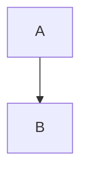

## 2. Direction

Top-down, then left-right. The same graph should be tall in one and wide in the other.

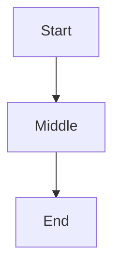

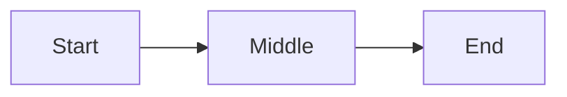

## 3. Node shapes

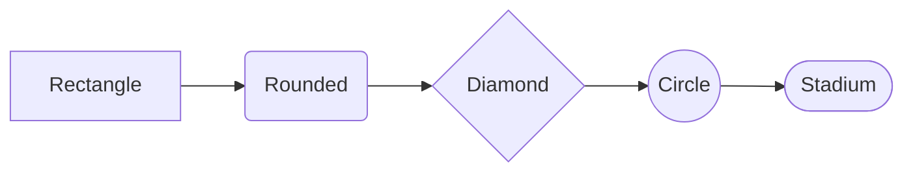

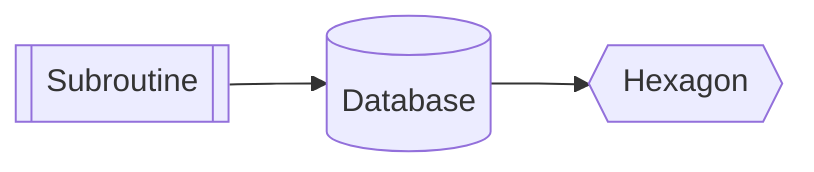

## 4. Edge labels

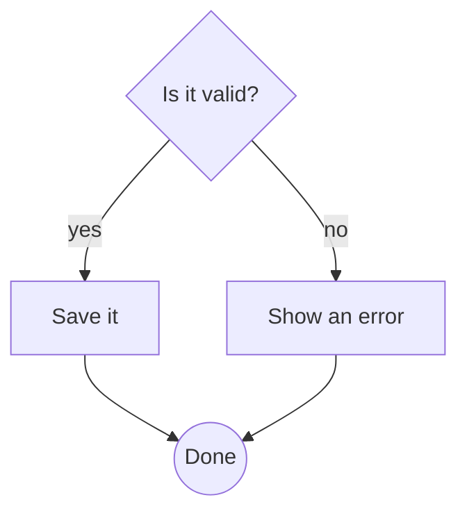

## 5. Edge styles

Solid, thick, dotted, and a line with no arrowhead.

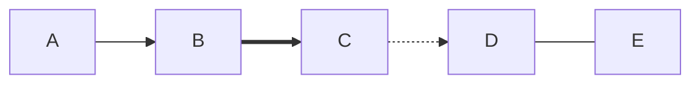

## 6. Branching and merging

Several paths out of one node and back into another — this is where node
ordering matters, because a bad order crosses edges unnecessarily.

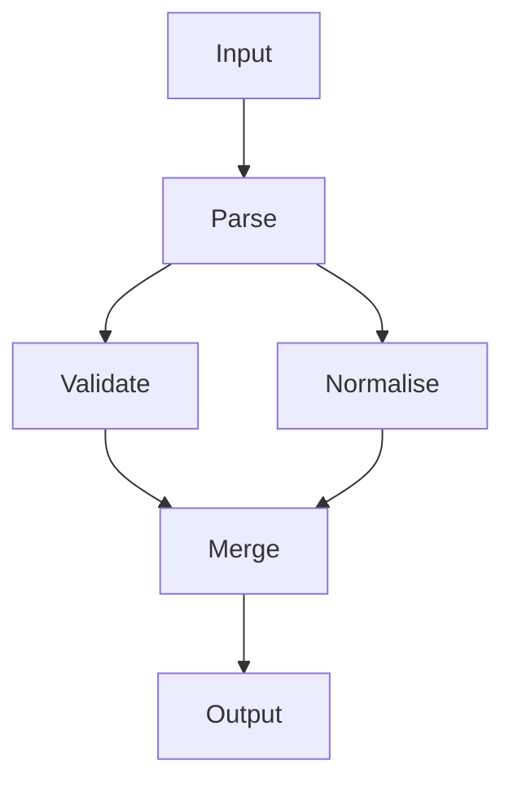

## 7. A longer chain

Ranking should keep this in a straight line.

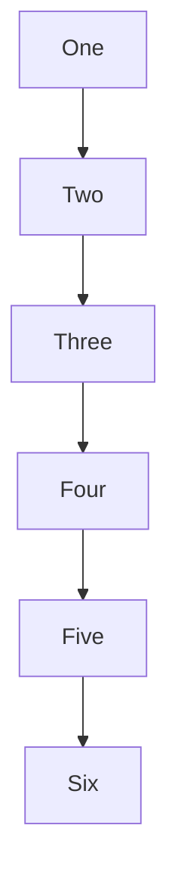

## 8. A cycle

A graph with a loop must still lay out — the cycle is broken for ranking, but
every edge is still drawn.

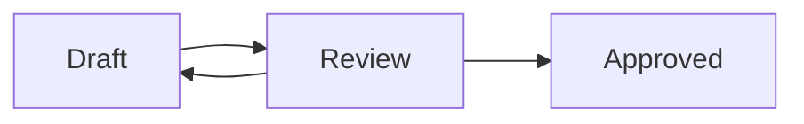

## 9. Disconnected pieces

Two unrelated graphs in one diagram.

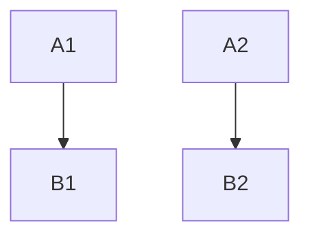

## 10. A realistic one

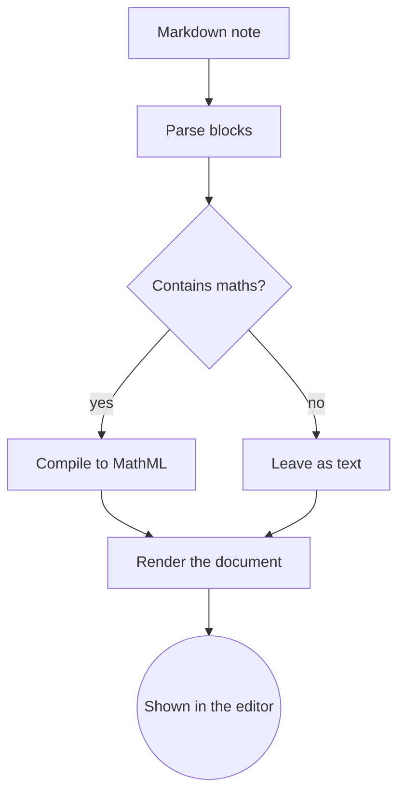

## 11. Subgraphs

Members should sit inside a dashed box carrying the group's title.

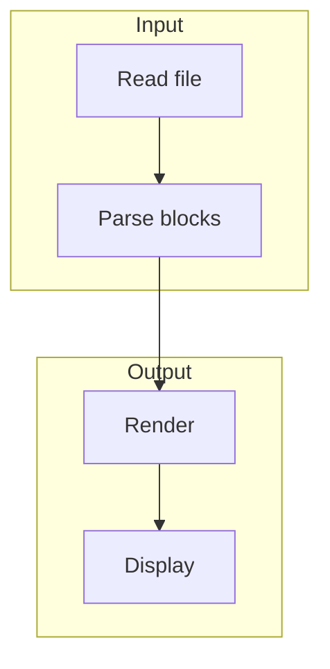

A subgraph with its own id and a separate title:

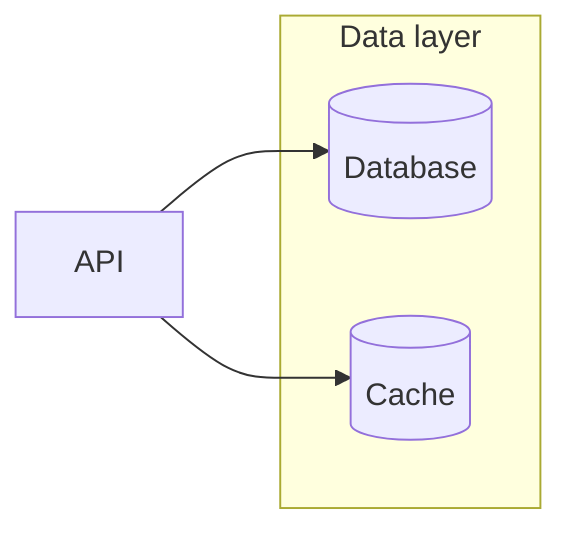

## 12. Edge endings

Arrow, circle, cross, and a bidirectional link.

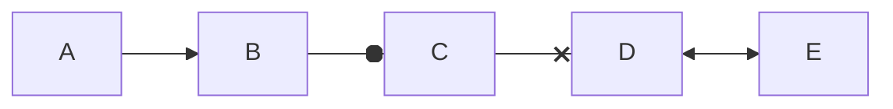

## 13. Line breaks in labels

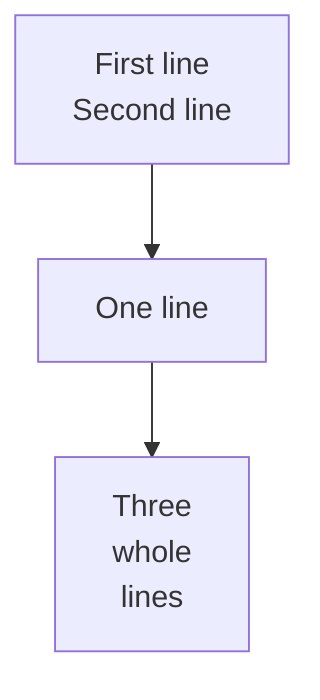

---

## 14. Sequence diagrams

Participants are columns, messages are rows.

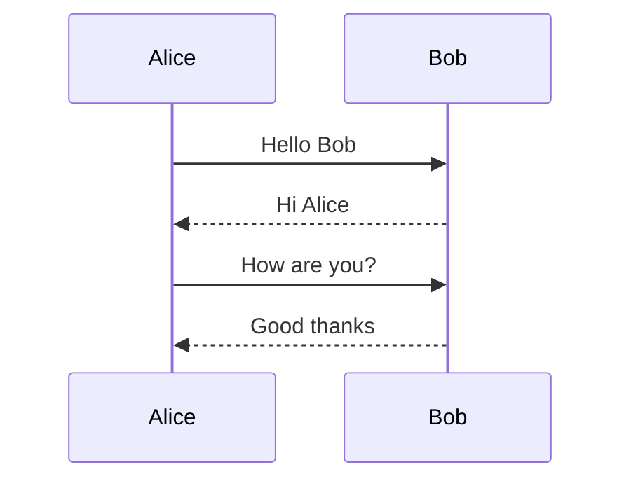

Arrow forms: solid, dashed, cross, and an open head for async.

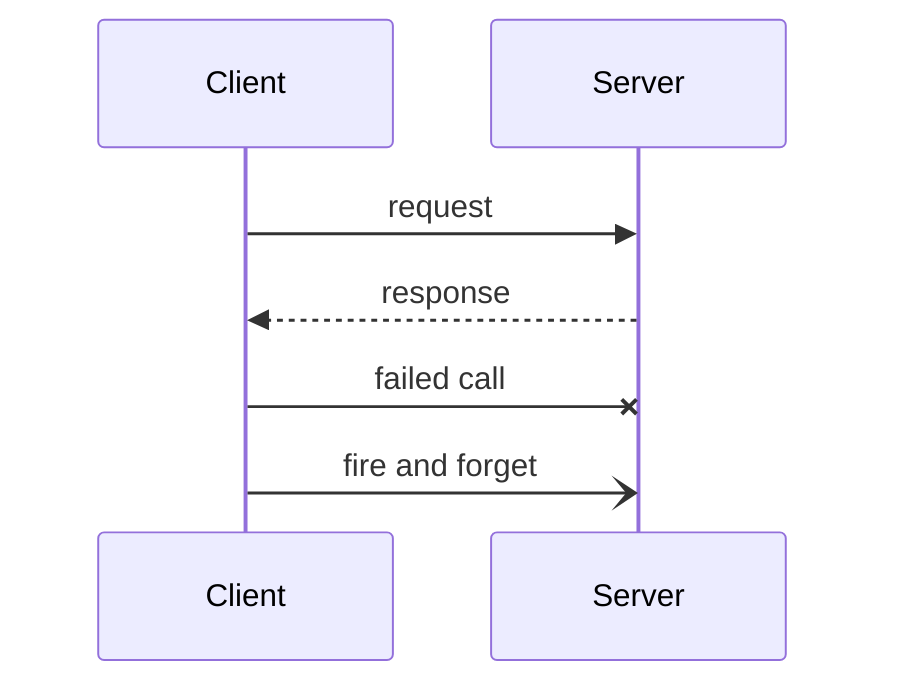

An actor, a self-message, and notes.

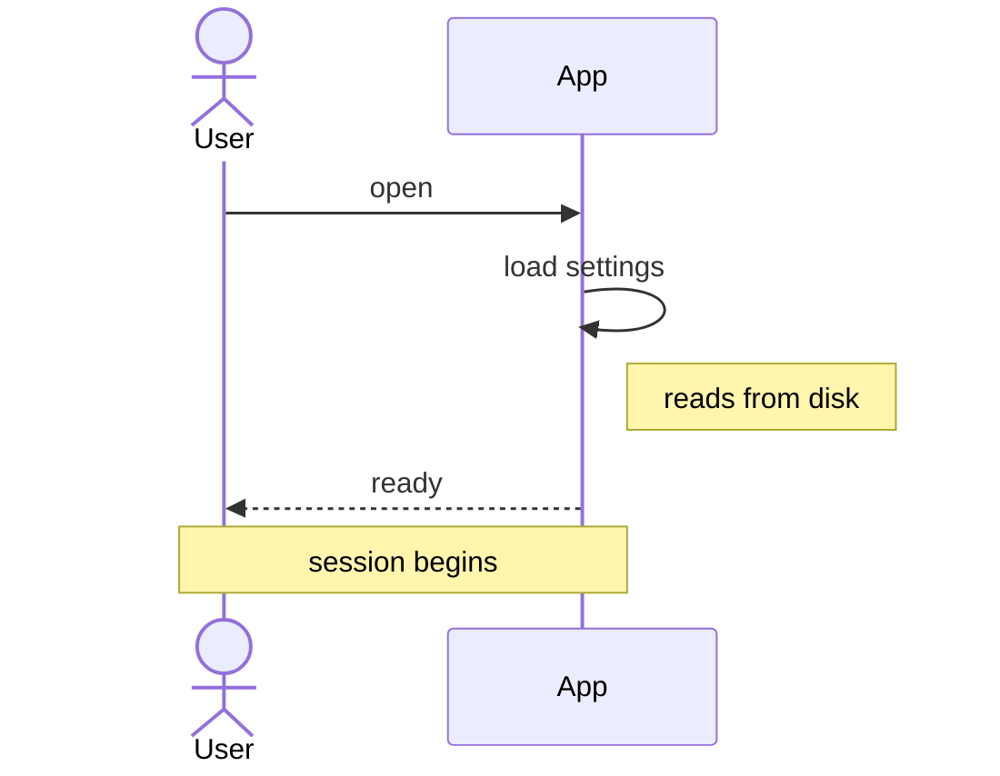

Loops, alternatives and activations.

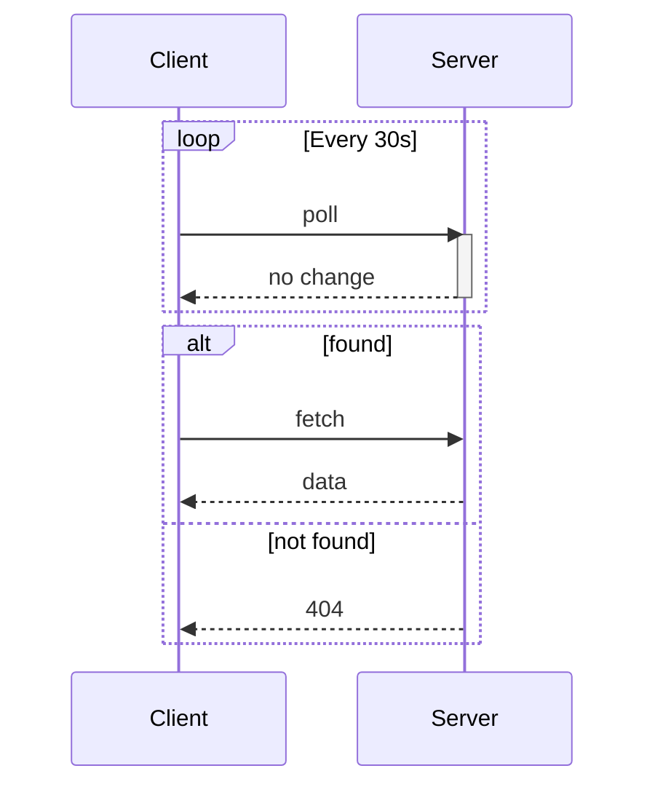

## 15. State diagrams

A filled dot marks the start and the end. Both are written `[*]`, but they are
separate nodes — otherwise the end would loop back to the beginning.

```mermaid
stateDiagram-v2
  [*] --> Idle
  Idle --> Running: start
  Running --> Idle: stop
  Running --> Failed: error
  Failed --> [*]
```

Left to right, with a described state:

```mermaid
stateDiagram-v2
  direction LR
  state "Waiting for input" as Wait
  [*] --> Wait
  Wait --> Processing: submit
  Processing --> Done
  Done --> [*]
```

## 16. Class diagrams

Inheritance, composition, aggregation and a plain association, each with its own
UML head.

```mermaid
classDiagram
  Animal <|-- Duck
  Animal <|-- Fish
  Duck *-- Feather
  Flock o-- Duck
  Duck --> Pond : swims in
```

Attributes and methods, both syntaxes:

```mermaid
classDiagram
  class Animal {
    +String name
    +int age
    +isMammal()
    +move()
  }
  Animal : +String habitat
  Animal <|-- Bird
  class Bird {
    +int wingspan
    +fly()
  }
```

---

## 17. ER diagrams

All four cardinalities at both ends, identifying (solid) and non-identifying
(dashed) relationships, and an attribute table with keys and a comment.

```mermaid
erDiagram
  CUSTOMER ||--o{ ORDER : places
  ORDER ||--|{ LINE-ITEM : contains
  PRODUCT |o..o{ LINE-ITEM : "appears in"
  CUSTOMER {
    string id PK
    string name
    string email UK "used to sign in"
  }
  ORDER {
    int number PK
    string customer FK
    date placed
  }
```

## 18. Pie charts

```mermaid
pie title Where the time went
  "Writing" : 42
  "Reviewing" : 23
  "Meetings" : 18
  "Email" : 12
  "Coffee" : 5
```

`showData` puts the values in the legend; a very thin slice keeps its legend entry but drops its label.

```mermaid
pie showData
  "Yes" : 97
  "No" : 2
  "Unsure" : 1
```

## 19. Gantt charts

Sections, `after` dependencies, durations, and the `done`, `active`, `crit`
and `milestone` tags.

```mermaid
gantt
  title Release plan
  dateFormat YYYY-MM-DD
  section Build
  Design           :done, des, 2026-10-01, 7d
  Engine           :active, eng, after des, 14d
  Samples          :smp, after des, 5d
  section Ship
  Review           :crit, rev, after eng, 4d
  Publish          :milestone, pub, after rev, 0d
  Announce         :after pub, 3d
```

## 20. User journeys

Scores 1–5 set each face's height and expression; coloured dots show who takes part.

```mermaid
journey
  title Installing epímonos
  section Discover
    Find it on the Marketplace: 4: Me
    Read the listing: 3: Me
  section Set up
    Install: 5: Me
    Choose a vault: 3: Me, Claude
    Connect an assistant: 2: Me, Claude
  section Use
    Write a note: 5: Me
    Assistant remembers: 5: Claude
```

---

## 21. Mindmaps

Written by indentation. The root sits in the middle, branches are balanced
left and right, and each branch keeps its own colour. Every node shape:
circle, rounded, square, hexagon, cloud, bang and the plain default.

```mermaid
mindmap
  root((epímonos))
    Editor
      Live editing
      (Typeset maths)
      [Diagrams]
    Vaults
      Explorer
      {{Rename keeps links}}
    AI memory
      )MCP server(
      Setup check
    ))Ship it((
```

## 22. Git graphs

Branches get a lane each; merges have two parents and a hollow centre;
tags sit above their commit. `cherry-pick` copies a commit across.

```mermaid
gitGraph
  commit
  commit id: "setup"
  branch develop
  checkout develop
  commit id: "engine"
  commit
  branch feature
  checkout feature
  commit id: "diagrams" type: HIGHLIGHT
  checkout develop
  merge feature
  checkout main
  commit id: "hotfix" type: REVERSE
  merge develop tag: "v1.0"
  checkout develop
  cherry-pick id: "hotfix"
```

Top to bottom:

```mermaid
gitGraph TB:
  commit
  branch develop
  commit
  checkout main
  merge develop tag: "v0.1"
```

---

## 23. Timelines

Periods along an axis with their events beneath. Continuation lines starting
with `:` add more events to the period above.

```mermaid
timeline
  title epímonos releases
  2026-09 : 0.6 first public release : Maths engine
  0.7 : Flowcharts, sequence, state, class
      : Editor-only setup
  0.8 : Rename keeps links
  0.9 : Embedded notes : ER, pie, gantt, journey
  0.10 : Mindmaps and git graphs
```

With sections, periods share their section's band and colour:

```mermaid
timeline
  section Build
    Design : Specs written
    Engine : Parser : Layout
  section Ship
    Publish : Marketplace
```

## 24. Quadrant charts

Numbered as Mermaid numbers them: 1 top right, 2 top left, 3 bottom left,
4 bottom right. Points take an optional radius and colour.

```mermaid
quadrantChart
  title What to build next
  x-axis Low effort --> High effort
  y-axis Low impact --> High impact
  quadrant-1 Plan carefully
  quadrant-2 Do now
  quadrant-3 Maybe later
  quadrant-4 Avoid
  Rename safety: [0.3, 0.9]
  Transclusion: [0.55, 0.8]
  Team memory: [0.85, 0.75] radius: 10
  Screenshots: [0.15, 0.35]
  esbuild bundling: [0.4, 0.3]
  Linux support: [0.8, 0.2] color: #e15759
```

## 25. XY charts

Bars and lines over one axis. Several bar series sit side by side; lines draw
on top. `xychart-beta`, the original keyword, still works.

```mermaid
xychart
  title "Notes written per month"
  x-axis [Jan, Feb, Mar, Apr, May, Jun]
  y-axis "Notes" 0 --> 120
  bar "Written" [42, 55, 61, 78, 95, 110]
  line "Linked" [20, 31, 40, 52, 70, 88]
```

On its side, with negative values and no axis ranges given:

```mermaid
xychart-beta horizontal
  title "Change this quarter"
  x-axis [Editor, Vaults, Memory, Export]
  bar [12, -4, 30, 7]
```

## 26. Sankey diagrams

Flows as ribbons, thickness by quantity. Written as CSV — a name with a comma
is quoted, and `""` is a quote inside it.

```mermaid
sankey
Notes,Linked,60
Notes,Standalone,40
Linked,"Embedded, in full",25
Linked,By heading,20
Linked,By block,15
Standalone,Archived,30
Standalone,"The ""inbox""",10
```

## 27. Block diagrams

The author places everything: `columns` sets the grid, `:2` spans columns,
`space` leaves a gap, and `block … end` nests a grid of its own. Edges are
drawn between blocks without moving them.

```mermaid
block
  columns 3
  Editor["Markdown editor"]:2 Vault[("Vault")]
  space:3
  block:engines:2
    columns 2
    maths(("Maths")) diagrams{{"Diagrams"}}
  end
  arrow<["writes to"]>(down)
  memory[["AI memory"]]:3
  Editor --> Vault
  engines --> memory
```

Every shape:

```mermaid
block-beta
  columns 4
  a["Rectangle"] b("Rounded") c(["Stadium"]) d[["Subroutine"]]
  e[("Cylinder")] f(("Circle")) g((("Double"))) h>"Flag"]
  i{"Rhombus"} j{{"Hexagon"}} k[/"Parallel"/] l[/"Trapezoid"\]
  m<["Left"]>(left) n<["Right"]>(right) o<["Both"]>(x) p<["Up"]>(up)
```

## 28. Kanban boards

Columns and their cards come from indentation. Priority colours a card's
edge; with a `ticketBaseUrl` in the diagram's config, tickets become links.

```mermaid
---
config:
  kanban:
    ticketBaseUrl: 'https://github.com/Save5Bucks/epimonos/issues/#TICKET#'
---
kanban
  todo[To do]
    t1[Requirement diagrams]@{ priority: 'Low' }
    t2[Architecture diagrams]
  doing[In progress]
    t3[Block and kanban]@{ assigned: 'Claude', ticket: 42, priority: 'High' }
  done[Done]
    t4[XY and sankey]@{ assigned: 'Claude', priority: 'Very Low' }
    t5[Rename keeps links, which people get angry about losing]@{ ticket: 7, priority: 'Very High' }
```

## 29. Requirement diagrams

Requirements and elements list their fields; relationships are labelled
with their type. The backwards form `b <- type - a` means the same as
`a - type -> b`.

```mermaid
requirementDiagram
  requirement rename_safety {
    id: 1
    text: Renaming a note rewrites every link to it.
    risk: High
    verifymethod: Test
  }
  functionalRequirement code_untouched {
    id: 1.1
    text: Links in code are left as written.
    risk: Low
    verifymethod: Inspection
  }
  element link_update {
    type: module
    docref: src/vault/linkUpdate.ts
  }
  rename_safety - contains -> code_untouched
  link_update - satisfies -> rename_safety
  code_untouched <- verifies - link_update
```

## 30. C4 diagrams

People, systems, containers and components in the C4 model's colours, in
dashed boundaries. Placement follows statement order, as in Mermaid.

```mermaid
C4Context
  title epímonos in context
  Person(user, "Note taker", "Writes Markdown in VS Code")
  Person_Ext(assistant, "AI assistant", "Claude, Copilot")
  Enterprise_Boundary(ext, "epímonos") {
    System(editor, "Markdown editor", "Live editing, maths, diagrams")
    SystemDb(vault, "Vault", "Plain Markdown files")
    System(mcp, "Vault Memory", "MCP server")
  }
  System_Ext(obsidian, "Obsidian", "Optional")
  Rel(user, editor, "Writes notes in")
  Rel(editor, vault, "Reads and writes")
  Rel(assistant, mcp, "Remembers with", "MCP")
  Rel(mcp, vault, "Stores notes in")
  BiRel(obsidian, vault, "Opens the same files")
```

Containers carry their technology:

```mermaid
C4Container
  UpdateLayoutConfig($c4ShapeInRow="3")
  Container(webview, "Webview", "JavaScript", "Renders the editor")
  Container(host, "Extension host", "TypeScript", "Files, links, settings")
  ContainerQueue(msgs, "Messages", "postMessage")
  Rel(webview, msgs, "Posts")
  Rel(msgs, host, "Delivers")
```

## 31. Packet diagrams

Rows of 32 bits; each field spans its bits and splits where it wraps. `+N`
follows on from the field before. A gap between fields falls back to code, as
Mermaid refuses it.

```mermaid
packet
  title TCP header
  0-15: "Source port"
  16-31: "Destination port"
  32-63: "Sequence number"
  64-95: "Acknowledgment number"
  96-99: "Offset"
  100-105: "Reserved"
  106: "URG"
  107: "ACK"
  108: "PSH"
  109: "RST"
  110: "SYN"
  111: "FIN"
  112-127: "Window"
  +16: "Checksum"
  +16: "Urgent pointer"
  +40: "Options — wraps onto the next row"
```

## 32. Radar charts

Values on spokes, a polygon per curve. Curves list values in axis order, or
by axis id. `graticule polygon` draws the rings as polygons.

```mermaid
radar-beta
  title What each engine does best
  axis speed["Speed"], size["Small size"], fidelity["Fidelity"]
  axis offline["Works offline"], setup["No setup"]
  curve ours["epímonos"]{8, 9, 7, 10, 9}
  curve theirs["Mermaid"]{ fidelity: 10, speed: 6, size: 3, offline: 10, setup: 7 }
  max 10
  graticule polygon
```

## 33. Architecture diagrams

Services sit where their edges' sides say — `a:R -- L:b` puts b to a's
right. Groups enclose their services; `{group}` runs an edge from the group's
edge. The five built-in icons are drawn; an icon from another pack shows its
first letter.

```mermaid
architecture-beta
  group vscode(cloud)[VS Code]
  service editor(server)[Markdown editor] in vscode
  service host(server)[Extension host] in vscode
  service vault(disk)[Vault]
  service memory(database)[Vault Memory]
  service web(internet)[Assistants]
  junction j
  editor:R <--> L:host
  host:B --> T:j
  j:L -- R:vault
  j:R --> L:memory
  memory:R <-- L:web
```

## 34. Treemaps

A hierarchy as nested rectangles, sized by value; a section is the sum of
what it holds. Laid out to keep rectangles as square as possible.

```mermaid
treemap-beta
"media"
  "diagram.js": 180
  "editor.js": 95
  "markdown.js": 48
  "math.js": 36
  "editor.css": 30
"src"
  "memoryIntegration.ts": 40
  "editorProvider.ts": 25
  "vault"
    "linkUpdate.ts": 12
    "renameLinks.ts": 6
    "vaultCommands.ts": 9
"test"
  "diagram.test.js": 70
  "other tests": 45
```

## 35. Venn diagrams

Circles are drawn to area — radius from each set, overlap from each union —
using `:N` sizes, or Mermaid's defaults without them. Two sets overlap only
if a `union` names them. Text nodes list what sits in a region.

```mermaid
venn-beta
  title What makes a good feature
  set Desirable
  set Feasible
  set Viable
  union Desirable,Feasible["Buildable"]
  union Feasible,Viable["Sustainable"]
  union Desirable,Viable["Marketable"]
  union Desirable,Feasible,Viable["Ship it"]
```

Sized, with text nodes:

```mermaid
venn-beta
  set A["Frontend"]:20
    text A1["React"]
    text A2["Design systems"]
  set B["Backend"]:12
    text B1["API"]
  union A,B["Shared"]:4
    text AB1["OpenAPI"]
```

Four or more sets are fitted rather than placed exactly, as Mermaid does;
each label goes where its region is deepest.

```mermaid
venn-beta
  title Skills on the team
  set Design
  set Frontend
  set Backend
  set Data
  union Design,Frontend["UI"]
  union Frontend,Backend["Full stack"]
  union Backend,Data["Pipelines"]
  union Data,Design["Dashboards"]
```

## 36. Ishikawa (fishbone) diagrams

The first line is the problem, at the head. Lines at the same indentation
after it are categories — bones alternating above and below the spine — and
deeper lines are causes, then sub-causes.

```mermaid
ishikawa-beta
    Blurry Photo
    Process
        Out of focus
        Shutter speed too slow
        Protective film not removed
        Beautification filter applied
    User
        Shaky hands
    Equipment
        LENS
            Inappropriate lens
            Damaged lens
            Dirty lens
        SENSOR
            Damaged sensor
            Dirty sensor
    Environment
        Subject moved too quickly
        Too dark
```

## 37. Tree views

A directory tree from indentation. A trailing `/` is a folder, `## text` a
description, `:::highlight` highlights a row.

```mermaid
treeView-beta
    My Vault/
        Projects/
            Roadmap.md :::highlight ## the note you are reading
            Launch plan.md
        Journal/
            2026-09-27.md ## today
        Attachments/
            diagram.png
        README.md
```

Box-drawing input works too, and `showIcons` turns on file and folder icons:

```mermaid
---
config:
  treeView:
    showIcons: true
---
treeView-beta
├── src/
│   ├── index.ts ## entry point
│   └── utils.ts
├── package.json
└── README.md
```

## 38. Use case diagrams

Actors, use cases and system boundaries. Include and extend are dashed and
labelled; generalization gets a hollow head.

```mermaid
usecase-beta
direction LR
actor Customer
actor Support
systemBoundary Storefront
  Browse("Browse catalogue")
  Checkout("Checkout")
end
systemBoundary Fulfilment
  Track("Track delivery")
end
Customer --> Browse
Customer --> Checkout
Customer --> Track
Support --> Track
Checkout ..> : include Browse
```

Stereotypes, rectangles, labelled associations and generalization:

```mermaid
usecase-beta
actor Admin("Administrator") <<Employee>>
actor Person
Report[Generate report]
"Reset password"
Admin --|> Person
Admin -- "runs monthly" --> Report
Person --> Reset_password
```

## 39. Cynefin framework

Five fixed domains with wavy boundaries and the "cliff" between Clear and
Chaotic. Items are badges; transitions are curved arrows.

```mermaid
cynefin-beta
  title Strategy Categorization
  complex
    "Market research"
  complicated
    "Competitive analysis"
  clear
    "Standard pricing"
  chaotic
    "Crisis management"
  confusion
    "Unknown failure mode"
  complex --> complicated : "Pattern identified"
  complicated --> clear : "Best practice codified"
  clear --> chaotic : "Complacency"
  chaotic --> complex : "Stabilized"
```

## 40. Wardley maps

Coordinates are `[visibility, evolution]` — y before x, as OnlineWardleyMaps
writes them. Sourcing decorators, inertia, evolve arrows, flows, notes,
numbered annotations and accelerators are drawn.

```mermaid
wardley-beta
title Tea Shop Value Chain
anchor Business [0.95, 0.63]
component Cup of Tea [0.79, 0.61]
component Tea [0.63, 0.81] (buy)
component Hot Water [0.52, 0.80]
component Kettle [0.43, 0.35] (build) (inertia)
component Power [0.10, 0.70] (market)
Business -> Cup of Tea
Cup of Tea -> Tea
Cup of Tea +> Hot Water
Hot Water -> Kettle
Kettle -.-> Power
evolve Kettle 0.62
evolve Power 0.89
note "Standardising power lets kettles evolve" [0.30, 0.40]
annotations [0.97, 0.03]
annotation 1,[0.43, 0.30] "Kettle has inertia"
accelerator "Commoditisation" [0.20, 0.55]
```

## 41. Swimlanes

Flowchart syntax where each top-level `subgraph` is a lane running the length
of the diagram. The keyword is `swimlane-beta`, singular.

```mermaid
swimlane-beta LR
  subgraph Customer
    request[Request service]
    receive[Receive update]
  end
  subgraph Support
    triage[Triage request]
    answer[Send answer]
  end
  subgraph Engineering
    investigate[Investigate issue]
    fix[Prepare fix]
  end
  request --> triage
  triage -->|Known issue| answer
  triage -->|Needs code change| investigate
  investigate --> fix --> answer
  answer --> receive
```

## 42. Railroad diagrams

Syntax diagrams from EBNF, ABNF, PEG or Mermaid's own constructors.
Terminals are rounded, rule names square; a choice branches, an optional
part has a bypass above, repetition a loop beneath.

```mermaid
railroad-ebnf-beta
title "JSON Grammar"
json = element ;
element = object | array | string | number | "true" | "false" | "null" ;
object = "{" [ member ( "," member )* ] "}" ;
member = string ":" element ;
```

ABNF, with its repetition prefixes:

```mermaid
railroad-abnf-beta
title "Email Address"
address = local-part "@" domain ;
local-part = 1*( ALPHA / DIGIT / "." / "-" ) ;
domain = label *( "." label ) ;
```

## 43. Event modeling

A timeline of numbered frames, each in a swimlane by type, plus a lane per
namespace. Relations are inferred frame to frame; `rf` starts a fresh chain.
Data shows beneath its frame.

```mermaid
eventmodeling
tf 01 ui CartUI
tf 02 cmd AddItem [[AddItem01]]
tf 03 evt ItemAdded { description: string, price: number }
rf 04 evt External.InventoryChanged
tf 05 pcr InventoryProcessor
tf 06 cmd ChangeInventory
tf 07 evt Cart.InventoryChanged
data AddItem01 {
  description: 'john'
  price: 20.4
}
```

## 44. Agentflow

Flowcharts for systems of agents: `flow … end` containers that nest, shapes
that mean something (task, tool, input, decision, refdoc, action), and three
kinds of edge — sequence, reference (dotted) and failure (red cross).

```mermaid
agentflow-beta TB
  brief["Release brief"]@{ shape: input }
  flow writer["Drafting Agent"]
    draft["Draft the notes"]@{ shape: task }
    lookup["changelog_search"]@{ shape: tool }
    guide["Tone of voice"]@{ shape: refdoc }
    draft --> lookup
    draft -.- guide
  end
  flow reviewer["Review Agent"]
    check["Check the claims"]@{ shape: task }
    ok["Accurate?"]@{ shape: decision }
    check --> ok
  end
  publish["Publish"]@{ shape: action }
  brief --> writer
  writer --> reviewer
  ok -- yes --> publish
  ok -- no --x draft
```

---

## 45. ZenUML — calls, replies and fragments

Sync calls nest in `{ }` bodies with activation bars; `return` and assignments
draw dashed replies; `new` creates a participant where it is called. Comments
sit above the message they precede.

```mermaid
zenuml
  title Order Service
  @Actor Client
  @Boundary OrderController
  @Database OrderDB
  // Place an order
  Client->OrderController.post(order) {
    OrderService.create(order) {
      new Order(items)
      if(valid) {
        id = OrderDB.save(order)
      } else {
        return error
      }
      OrderService->Queue: order created
      return id
    }
  }
```

## 46. ZenUML — loops, par, opt and try/catch

```mermaid
zenuml
  title Booking
  A as Alice
  J as John
  A->J: Hello John, how are you?
  while(true) {
    J->A: Great!
  }
  par {
    A->J: Hello!
    A->Bot: Hello!
  }
  opt {
    J->A: Thanks for asking
  }
  try {
    Consumer->API: Book something
    API->BookingService: Start booking process
  } catch {
    API->Consumer: show failure
  } finally {
    API->BookingService: rollback status
  }
```

---

## 47. Gantt — excluded days, tick interval and today

`excludes weekends` shades the weekends and pushes each task's end past them,
so ten days of work still take ten working days; a task given a fixed
`YYYY-MM-DD` end is not moved. `tickInterval 1week` with `weekday monday`
puts a tick on every Monday. The red line is today, when today falls on the
chart; `todayMarker` styles it, or `todayMarker off` hides it.

```mermaid
gantt
  title Sprint plan
  dateFormat YYYY-MM-DD
  excludes weekends
  excludes 2026-10-12
  tickInterval 1week
  weekday monday
  todayMarker stroke-width:3px,stroke:#e15759
  section Build
  Spec          :done, spec, 2026-09-21, 5d
  Build         :active, build, after spec, 10d
  Review        :after build, 3d
  section Ship
  Freeze        :milestone, after build, 0d
  Launch        :2026-10-19, 2026-10-23
```
